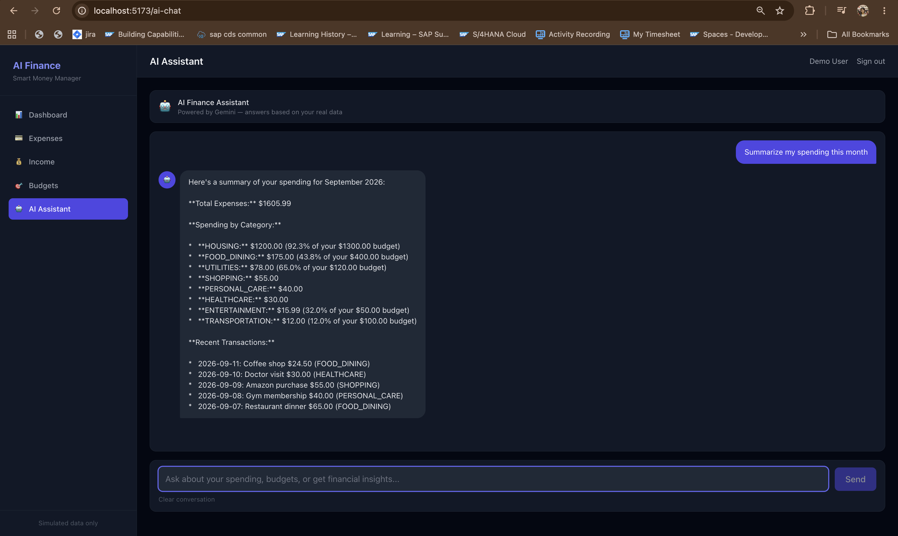
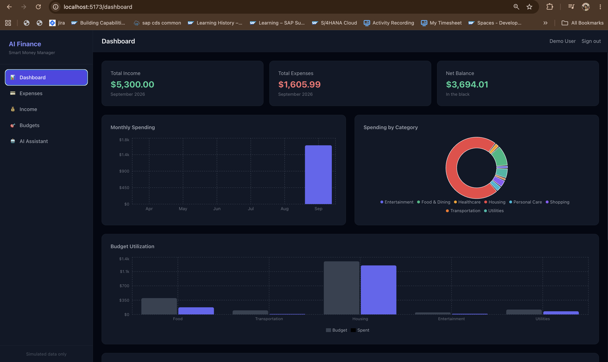
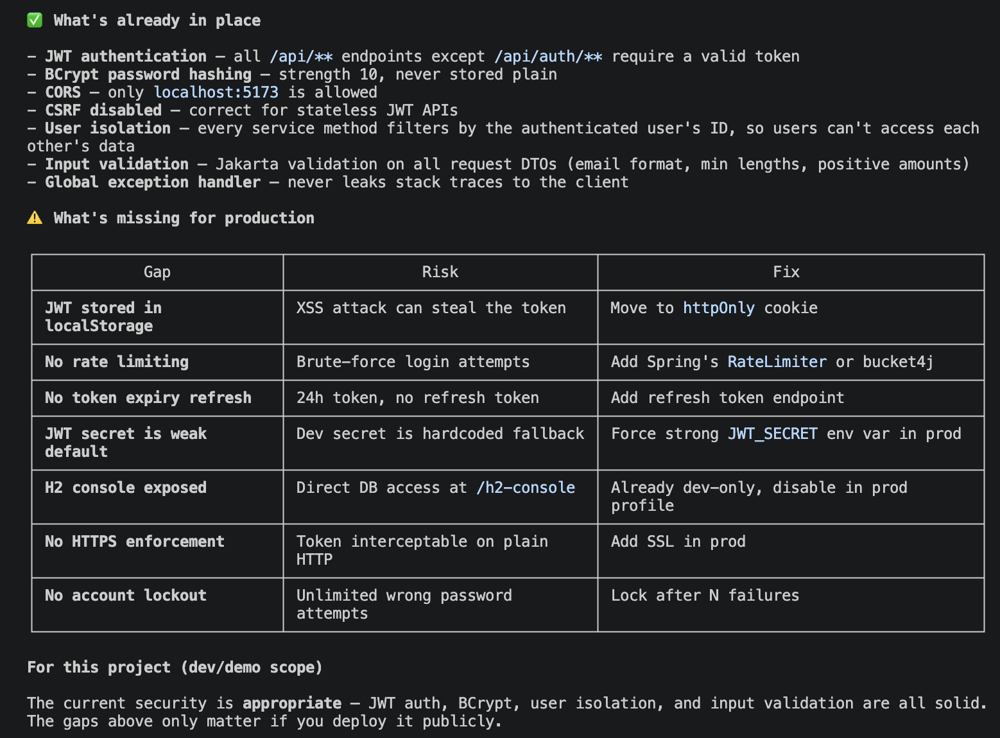

# AI Finance & Expense Management System

A full-stack personal finance management application with AI-powered expense categorization and a conversational finance assistant.



---

## What Was Built

### Backend (`backend/`) — Spring Boot 3.3, Java 21, H2, JWT
- 4 JPA entities: User, Expense, Income, Budget
- 7 REST controllers with full CRUD + pagination + filtering
- Gemini AI integration — expense categorization + finance chat using real user data
- Global exception handling with proper HTTP status codes
- 30 unit/integration tests — all passing

### Frontend (`frontend/`) — React 18, Vite, Tailwind CSS (dark theme), Recharts
- 7 pages: Login, Register, Dashboard, Expenses, Income, Budgets, AI Chat
- Dashboard with 3 charts (monthly spending bar, category pie, budget utilization bar)
- AI expense form with one-click "Suggest Category" button
- AI chat with suggested questions, conversation history, typing indicator

---

## Screenshots




---

## Tech Stack

| Layer | Technology |
|---|---|
| Backend | Java 21, Spring Boot 3.3, Spring Security (JWT), Spring Data JPA |
| Database | H2 (in-memory) |
| AI | Google Gemini 2.5 Flash |
| Frontend | React 18, Vite, Tailwind CSS, Recharts |
| Testing | JUnit 5, Mockito 5 |

---

## Prerequisites

- **Java 21+** — [Download](https://adoptium.net/)
- **Maven 3.9+** — `brew install maven`
- **Node.js 20+** — [Download](https://nodejs.org/)
- **Google Gemini API key** — [Get one free](https://aistudio.google.com/app/apikey)

---

## Local Setup

### 1. Clone the repository

```bash
git clone https://github.com/prar1hana/AI-Finance-Expense-Management-System.git
cd AI-Finance-Expense-Management-System
```

### 2. Configure the Gemini API key

Open `backend/src/main/resources/application-dev.properties` and replace `YOUR_GEMINI_API_KEY_HERE` with your actual key:

```properties
gemini.api.key=YOUR_GEMINI_API_KEY_HERE
```

Get a free key at [Google AI Studio](https://aistudio.google.com/app/apikey) → click **Get API key**.

**Gemini model in use:** `gemini-2.5-flash`

This is configured in `backend/src/main/resources/application.properties`:
```properties
gemini.api.url=https://generativelanguage.googleapis.com/v1beta/models/gemini-2.5-flash:generateContent
```

**To switch to a different model** (e.g. `gemini-2.5-pro`), change only the model name in that URL. To find models available for your API key:
```bash
curl "https://generativelanguage.googleapis.com/v1beta/models?key=YOUR_KEY" | grep '"name"'
```

### 3. Start the backend

```bash
cd backend
mvn spring-boot:run -Dspring-boot.run.profiles=dev "-Dspring-boot.run.jvmArguments=-XX:+EnableDynamicAgentLoading"
```

Wait for `Started FinanceAiApplication` in the output. Backend runs at **http://localhost:8080**

### 4. Start the frontend

Open a new terminal tab:

```bash
cd frontend
npm install
npm run dev
```

Frontend runs at **http://localhost:5173**

---

## Demo Account

A demo account with sample data is pre-loaded on every backend start:

| Field | Value |
|---|---|
| Email | demo@example.com |
| Password | password123 |

Sample data includes: 10 expenses, 2 income records, 5 budgets for the current month.  
You can also register a new account at http://localhost:5173/register

---

## Database Notes

Data is **in-memory only** — it resets on every backend restart. This is expected H2 behavior for development.

**To view the database while the backend is running:**
- Open http://localhost:8080/h2-console
- JDBC URL: `jdbc:h2:mem:financedb`
- Username: `sa`, Password: *(leave empty)*
- Run queries like `SELECT * FROM EXPENSES`, or export to CSV

**The mock data** is loaded by `DataLoader.java` — a Spring `CommandLineRunner` that runs automatically on startup and inserts the demo account + sample records.

### Switching to file-based H2 (data persists across restarts)

In `backend/src/main/resources/application-dev.properties`, make these two changes:

```properties
# Change this:
spring.datasource.url=jdbc:h2:mem:financedb;DB_CLOSE_DELAY=-1;DB_CLOSE_ON_EXIT=FALSE
# To this:
spring.datasource.url=jdbc:h2:file:./data/financedb;DB_CLOSE_DELAY=-1;DB_CLOSE_ON_EXIT=FALSE;AUTO_SERVER=TRUE

# Change this:
spring.jpa.hibernate.ddl-auto=create-drop
# To this:
spring.jpa.hibernate.ddl-auto=update
```

---

## Running Tests

```bash
cd backend
mvn test
```

30 tests across service, controller, and repository layers.

---

## API Endpoints

All authenticated endpoints require: `Authorization: Bearer <token>`

| Method | Endpoint | Auth | Description |
|---|---|---|---|
| POST | `/api/auth/register` | No | Register new user |
| POST | `/api/auth/login` | No | Login, receive JWT |
| GET | `/api/expenses` | Yes | List expenses (paginated, filterable) |
| POST | `/api/expenses` | Yes | Create expense |
| PUT | `/api/expenses/{id}` | Yes | Update expense |
| DELETE | `/api/expenses/{id}` | Yes | Delete expense |
| GET | `/api/incomes` | Yes | List income records |
| POST | `/api/incomes` | Yes | Create income |
| GET | `/api/budgets` | Yes | List budgets with spent amounts |
| POST | `/api/budgets` | Yes | Create budget |
| GET | `/api/dashboard/summary` | Yes | Balance, income, expense totals |
| GET | `/api/dashboard/monthly-spending` | Yes | Month-by-month chart data |
| GET | `/api/dashboard/recent-transactions` | Yes | Recent transactions |
| POST | `/api/ai/categorize` | Yes | Suggest category from description |
| POST | `/api/ai/chat` | Yes | Finance assistant chat |

---

## Project Structure

```
├── backend/
│   └── src/main/java/com/financeai/
│       ├── config/          # Security, CORS, DataLoader
│       ├── controller/      # 7 REST controllers
│       ├── dto/             # Request/Response DTOs
│       ├── entity/          # JPA entities
│       ├── exception/       # Global exception handling
│       ├── repository/      # Spring Data JPA repositories
│       ├── security/        # JWT provider and filter
│       └── service/         # Business logic
│
└── frontend/
    └── src/
        ├── api/             # Axios API modules
        ├── components/      # Charts, forms, layout, common UI
        ├── context/         # Auth context
        ├── pages/           # All 7 pages
        └── utils/           # Formatters and constants
```

---

## Security

- JWT stored client-side, all endpoints protected except `/api/auth/**`
- BCrypt password hashing (strength 10)
- User data isolation — users can only access their own records
- Input validation on all request DTOs
- CORS restricted to `localhost:5173`

### Not implemented (future improvements)
- Email verification on registration
- Forgot password / reset flow
- Rate limiting on login endpoint
- Account lockout after failed attempts

---

## Real Bank Data Integration (Future)

Currently all data is entered manually. For read-only transaction fetching in India:


**Most practical option right now — CSV Import:**  
GPay and Paytm both allow exporting transaction history as CSV. A future "Import CSV" feature could:
1. User exports CSV from GPay/Paytm app
2. Uploads it to this app
3. AI auto-categorizes each transaction

For a full API-based solution, **Setu Account Aggregator** (`setu.co`) is the RBI-regulated standard — all major banks are mandated to support it and it has a free sandbox.

---

## Security Audit



---

## Scope

This is a **simulated** finance management application. It does not connect to real bank accounts, process real payments, or perform UPI transfers.
