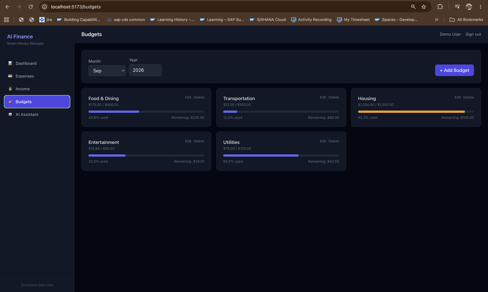
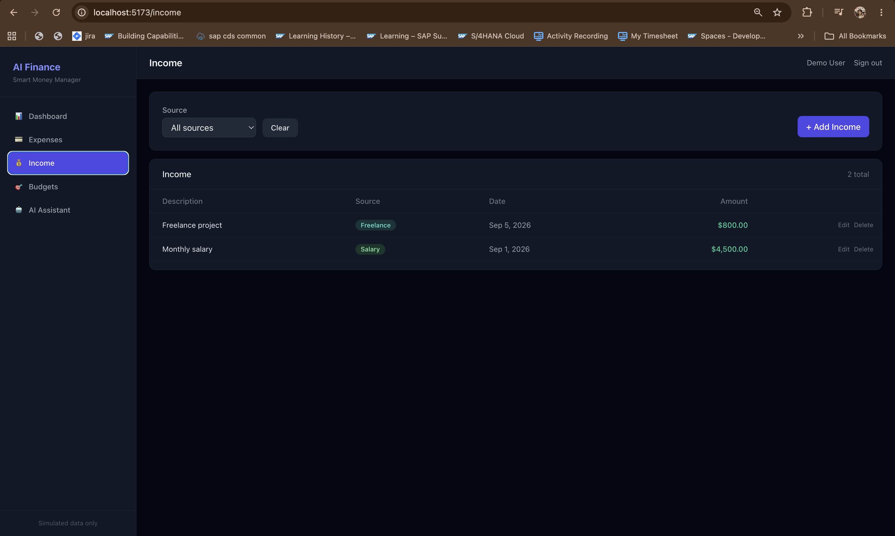
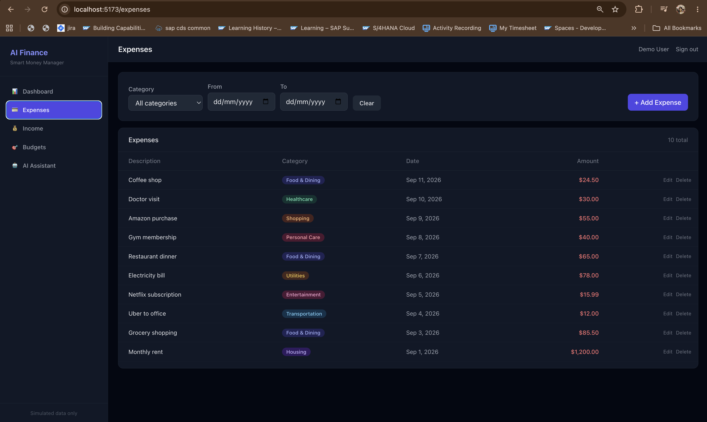
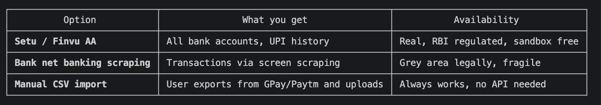

  # What was built

  # Backend (backend/) — Spring Boot 3.3, Java 21 target, H2, JWT auth:
  - 4 JPA entities: User, Expense, Income, Budget
  - 7 REST controllers with full CRUD + pagination + filtering
  - Gemini AI integration (expense categorization + finance chat using real user data)
  - Global exception handling with proper HTTP status codes
  - 30 unit/integration tests — all passing

  # Frontend (frontend/) — React 18, Vite, Tailwind CSS (dark theme), Recharts:
  - 7 pages: Login, Register, Dashboard, Expenses, Income, Budgets, AI Chat
  - Dashboard with 3 charts (monthly spending bar, category pie, budget utilization bar)
  - AI expense form with one-click "Suggest Category" button
  - AI chat with suggested questions, conversation history, typing indicator
  - Builds cleanly (npm run build)

# To run

# Backend
  cd backend
  export GEMINI_API_KEY=your_actual_key_here.   (I have already integrated now  in )
  mvn spring-boot:run -Dspring-boot.run.profiles=dev \
    -Dspring-boot.run.jvmArguments="-XX:+EnableDynamicAgentLoading"

  # Frontend (separate terminal)
  cd frontend && npm install && npm run dev

  Open http://localhost:5173 — log in as demo@example.com / password123 to see pre-loaded sample data.

  
  
  
  
  
  

  Also Data resets on reload — H2 in-memory database
  This is expected behavior. H2 in-memory means all data lives in RAM and is wiped every time the backend
  restarts. The SRS specified H2 for development.

 To not have anythign temp to switch to a file-based H2 database — same H2, but data is saved to disk. One line change:

  
# for in memory base -
      ⏺ Update(src/main/resources/application-dev.properties)
      spring.datasource.url=jdbc:h2:mem:financedb;DB_CLOSE_DELAY=-1;DB_CLOSE_ON_EXIT=FALSE    

      ⏺ Update(src/main/resources/application-dev.properties)
      5 -spring.jpa.hibernate.ddl-auto=create-drop                                                       
      5 +spring.jpa.hibernate.ddl-auto=update  

# for file based  
      ⏺ Update(src/main/resources/application-dev.properties)      
      pring.datasource.url=jdbc:h2:file:./data/financedb;DB_CLOSE_DELAY=-1;DB_CLOSE_ON_EXIT=FALSE;AUT
        +O_SERVER=TRUE 

    ⏺ Update(src/main/resources/application-dev.properties)
      5 +spring.jpa.hibernate.ddl-auto=create-drop                                                       
      5 -spring.jpa.hibernate.ddl-auto=update  

# for databse vieing you can do the follwing
- Open http://localhost:8080/h2-console
  - JDBC URL: jdbc:h2:mem:financedb
  - Username: sa, Password: (empty)
  - You can run SELECT * FROM EXPENSES etc. and even export to CSV from there

The mock data is loaded by DataLoader.java — a Spring CommandLineRunner that runs automatically every time the backend starts with demo@example.com creds

# improvements

## there is no email verification. When you register:

  1. You submit name + email + password
  2. Backend checks the email isn't already taken
  3. Password gets BCrypt hashed
  4. Account is created instantly
  5. JWT token is returned — you're logged in

  What IS validated:
  - Email must be a valid format (user@domain.com)
  - Password must be at least 8 characters
  - Duplicate emails are rejected (409 Conflict)

  What is NOT implemented:
  - No email verification link sent
  - No OTP/confirmation code
  - No "forgot password" / reset flow
  - No email service (no SMTP configured)

## we can intergrate with real data
  ---
  What actually works in India ( for read-only details)

  ---
  Most practical right now

  CSV import — GPay and Paytm both let users export their transaction history as a CSV file. You could add a
  "Import CSV" feature to this app that:
  1. User downloads CSV from GPay/Paytm app
  2. Uploads it here
  3. AI auto-categorizes each transaction
  
## security
